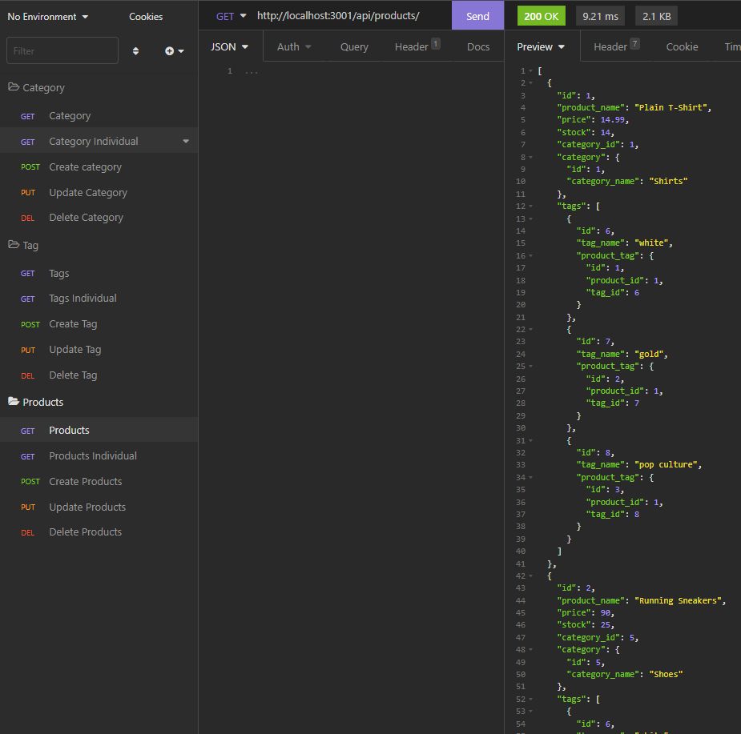

# Micelanian Store 3.6.5

## Description
This application is used to store and get information about an e-comerce website, it has the products classified by category and tags, or if you want to search categories and then their products you can do it, the same to the tags, you can see products by their tag. The application was made using the sequelize as ORM and uses nodejs with express.js to run the API, also for a security layer it uses dotenv to store personal information.

## Table of Contents (Optional)

- [Installation](#installation)
- [Usage](#usage)
- [Licence](#licence)

## Installation
First you have to clone the repo, then you've to install all the node packages typing npm install and then yo have to set up your envivorment variables with your info, then you have to create the database writing npm run seed and the database will be created and populated, then all you have to do is run server.js and it will be avaliable to answer the requests.

## Usage
You can do the basic operations with the app such as CRUD (create, read, update and delete), for that you can use inquirer and choose one of the 3 API endpoints:

/api/categories/

/api/products/

/api/tags/

## Licence
The Unlicense

## Questions
[Github Profile](https://github.com/braulioloaizac)

Email : bloaizac@uqvirtual.edu.co

[Click here to see the app in action (Video)](https://drive.google.com/file/d/1lp1CHx65HoS3D-prDZu7KvayF7_pov7V/view)

